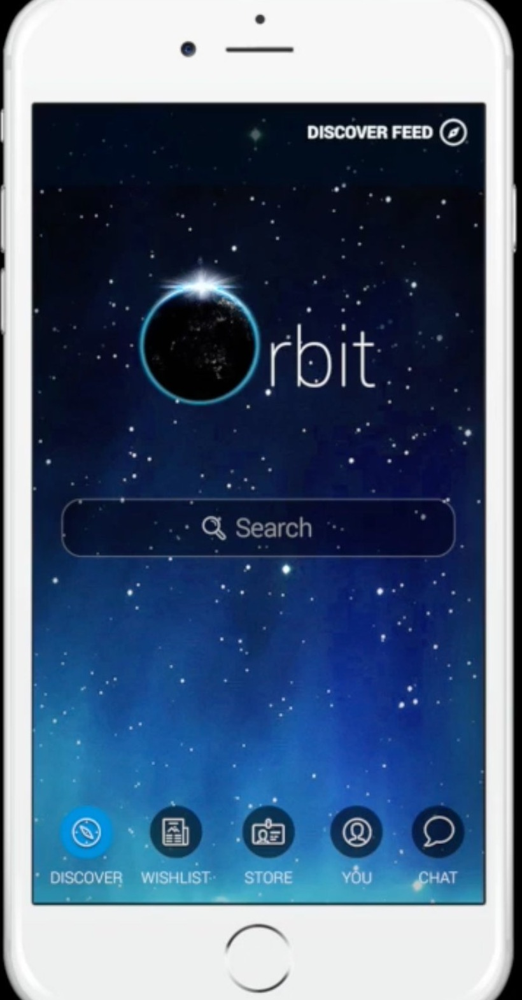
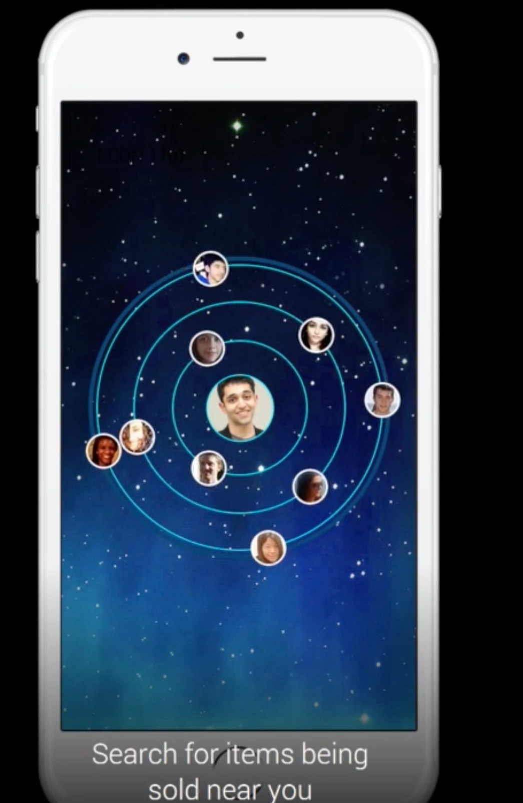
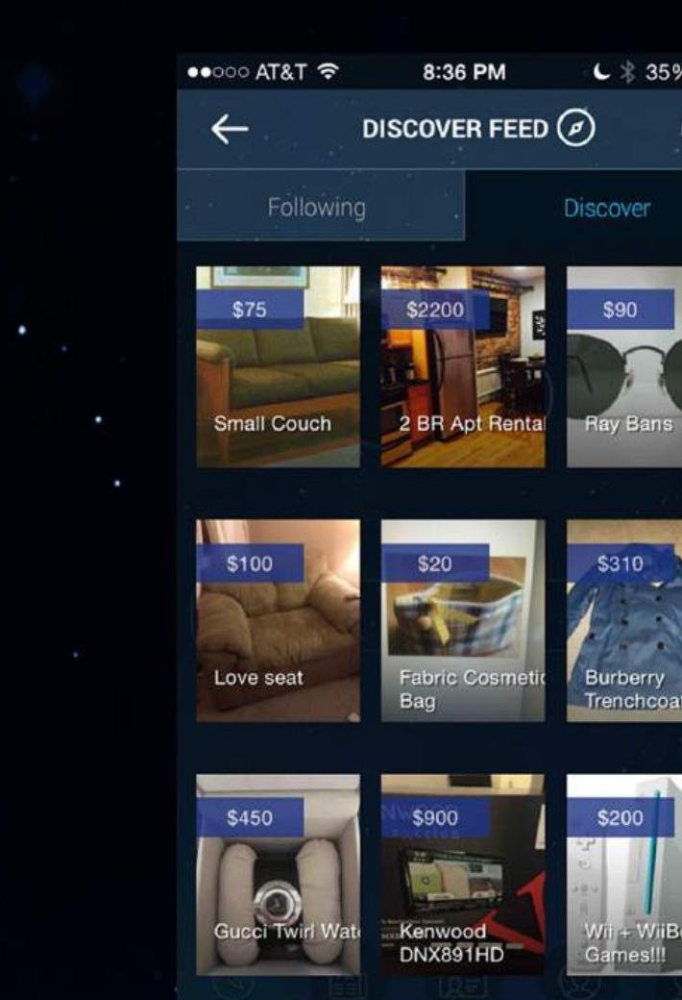
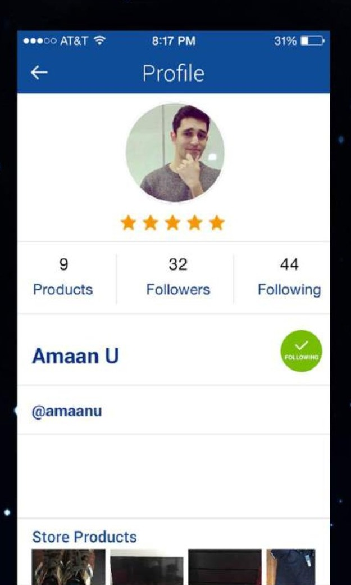
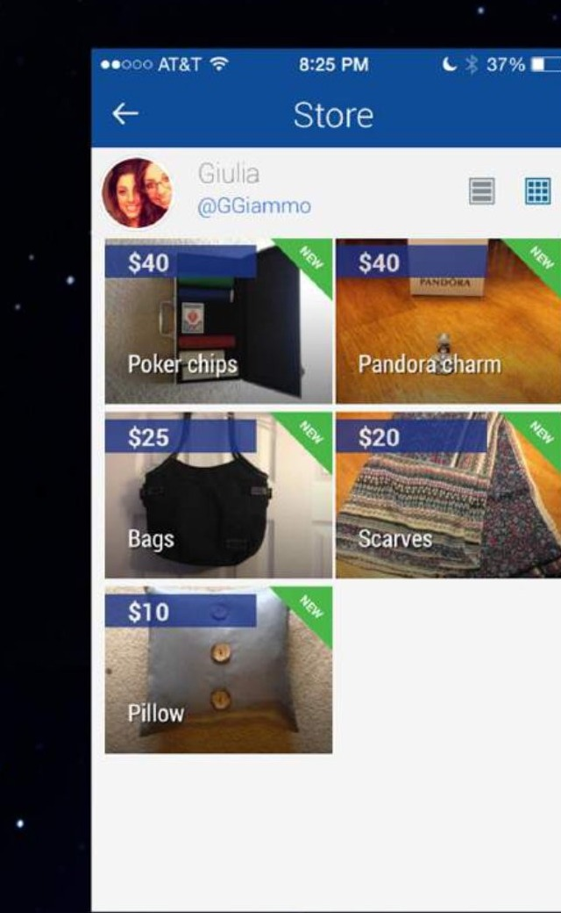

# Orbit Marketplace

**A social, hyperlocal peer-to-peer marketplace.** iOS and Android. January 2014 to August 2019.

---

## At a glance

| | |
|---|---|
| **Product** | Social, hyperlocal peer-to-peer marketplace for iOS and Android |
| **Dates** | January 2014 to August 2019 |
| **Users** | 100,000 across the U.S. and India |
| **Markets launched** | Four |
| **Capital raised** | $250K in grants and seed funding |
| **IP** | Patent application and trademark registration secured through IP counsel at Foley and Hoag |
| **Role** | Founder and Product Lead |

---

## What it looked like

| Home | Orbit discovery | Discover feed |
|---|---|---|
|  |  |  |
| Launch screen with five-tab bottom nav: Discover, Wishlist, Store, You, Chat. | Concentric rings showing nearby sellers, with the user's avatar at the center. In-product tagline: "Search for items being sold near you." | Grid feed of nearby listings, with Following and Discover tabs. |

| Profile | Store | Chat |
|---|---|---|
|  |  |  |
| Seller profile with @username identity, follower and following counts, product count, and a star rating from completed transactions. | Product grid with price overlays and NEW badges on fresh listings. Grid and list view toggle. | In-app chat scoped to a listing, with a Request to Buy action for structured transaction intent. |

---

## What I did

Designed the full product UX end to end (discover feed, user profiles, hyperlocal radius search, store grids, transaction flows) and handed off to engineering with full specs. Ran the product lifecycle across discovery, PRDs, design, engineering collaboration, A/B testing, and launch across four markets.

---

## Scale

- 100,000 users across the U.S. and India
- Four markets launched
- $250K raised in grants and seed funding
- Native iOS and Android apps

---

## Intellectual property

Patent application and trademark registration secured through IP counsel at Foley and Hoag. See `docs/PATENT_AND_TRADEMARK.md` for engagement details.

---

## References

- Product demo video: [youtube.com/watch?v=0f7A52u5P9A](https://www.youtube.com/watch?v=0f7A52u5P9A)
- Northeastern University (D'Amore-McKim): [Student app brings buying and selling to a radius near you](https://damore-mckim.northeastern.edu/news/student-app-brings-buying-and-selling-to-a-radius-near-you/)

---

## What's in this repo

```
orbit-marketplace/
├── README.md
├── screenshots/
│   ├── orbit_screen_home.jpg
│   ├── orbit_screen_radar.jpg
│   ├── orbit_screen_discover.jpg
│   ├── orbit_screen_profile.jpg
│   ├── orbit_screen_store.jpg
│   └── orbit_screen_chat.jpg
└── docs/
    ├── PRD.md
    ├── ARCHITECTURE.md
    └── PATENT_AND_TRADEMARK.md
```
